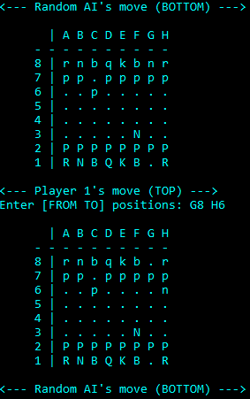

# Chess

This simple text-based Chess game features 4 different opponents: Player vs Player, Player vs RandomAI, Player vs AggressiveAI and Player vs SmartAI.

  

* The RandomAI will execute a random move from it's list of available moves
* The AggressiveAI will execute the move with the highest value piece it can currently take, otherwise if no take moves are available, a random move will be executed
* The SmartAI, similar to the AggressiveAI, will execute the move with the highest value piece it can currently take, but only if the move itself is safe enough to do so. Given a list of possible take moves, take the piece if:
  * The piece executing the take is **not** in danger of being taken in its new position
  * The piece executing the take **is** in danger of being taken in its new position, but the difference in piece values is in favour of the SmartAI's piece (or equal)
* If no take moves are available, select a move from the list of available random moves that does **not** put that piece in danger
